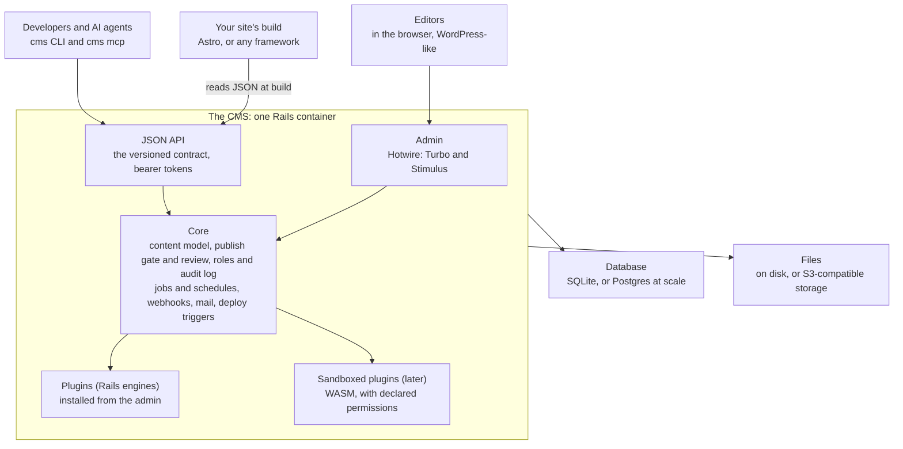

# Vision and architecture

As of 2026-09-28.

## The pitch

**WordPress's editing experience, Contentful's API, native to AI agents, in
one container, with plugins you install from the admin.**

LibrePublish is an open-source, headless CMS built on Rails. Editors get an
admin that feels like WordPress. Developers and AI agents get a stable JSON
API, a `cms` CLI and an MCP server that do everything the admin does. Sites
render the content with any frontend, starting with Astro. It runs as one
container with no other services: a small business can be live in minutes,
and an enterprise can run it on Postgres behind a load balancer.

No CMS was built for agents from the start. That, the one-container install
and a plugin system with declared permissions are what the big players can't
easily copy. It is built on Rails so it serves clients today; the stack can
change later without changing the contract.

## Who it's for

The same product has to be the easy choice for a five-person business and the
approvable choice for a global brand.

| Need | Small business | Enterprise |
| --- | --- | --- |
| Getting started | Five-minute install, or a hosted plan | Runs in their cloud, on their database |
| Editing | Feels like WordPress | Same, across many sites and locales |
| Look on day one | Starter sites that look good | Their own design system, any frontend |
| Extending it | One-click plugins | Plugins a security team can sign off |
| Control | Roles, review before publishing | SSO (SAML/OIDC), SCIM, audit export |
| Change safety | Drafts and previews | Staging to production content promotion |
| Scale | One small server | Postgres, object storage, several nodes, CDN |
| Trust | Backups, simple updates | Support, SLAs, security certifications |

Three more groups make it spread: **developers** who choose the stack,
**agencies** who build many sites, and **AI agents** that now do much of the
content work.

## Principles

1. **The API, CLI and MCP are the product.** The admin is for doing things by
   hand. Every screen has a command; nothing is admin-only.
2. **The JSON contract is sacred.** Versioned, documented, tested against
   golden files. A site built today still builds in five years.
3. **One container, no other services.** One command to run it, on any host
   with a persistent disk. Postgres, S3 and clustering are options, not
   requirements.
4. **Plugins can't break the site.** Installed plugins come from a signed,
   reviewed directory; sandboxed plugins can do only what they declare.
5. **Familiar before clever.** Editors should recognise every screen from
   WordPress: posts, pages, media, plugins, settings.
6. **Agents are users.** They sign in, carry roles, go through review, and
   appear in the audit log like anyone else.
7. **Headless, framework-agnostic.** Astro first; any frontend can read the
   contract.
8. **Your data, your server.** Self-hosting is first-class; the cloud is a
   convenience, never a lock-in.

## Architecture

The CMS is one Rails 8 app in one container: the admin, the JSON API and every
job run in it, with no Redis or separate services. The `cms` CLI and its MCP
server run on the developer's machine and call the same API.

Editors, developers, agents and the site's build all come in through the same
core, so every rule (roles, review before publishing, the audit log) applies to
all of them.

- **Data.** SQLite by default, with Solid Queue and Solid Cache: one data
  directory, backed up before every migration. Postgres for enterprise scale,
  with several containers behind a load balancer.
- **Files.** Active Storage, on disk by default; any S3-compatible store at
  scale, served through a CDN.
- **The JSON API** is the product's contract: versioned, documented, and
  checked against golden files on every release. The CLI and MCP call it like
  anyone else.
- **The admin** is Hotwire (Turbo and Stimulus) on Rails views, laid out like
  WordPress. No Node build.
- **Frontends** read the API at build time. Astro has a one-line installer and
  an integration; other frameworks get clients generated from the contract.
- **Hosting.** Kamal on any VPS, or any Rails host with a persistent disk
  (Render, Fly.io, Railway, Hatchbox). Not hosts that wipe the disk on
  restart, such as Heroku, unless it runs on Postgres and S3.
- **The CLI** is one Ruby file today; shipping it as a single download
  (Homebrew, npm or a standalone binary) removes the need for Ruby on a
  developer's machine.

## The plugin model

Installing a plugin should work like WordPress: find it in the admin's plugin
directory, click **Install**, switch it on. The foundation exists today:
plugins are Rails engines with a manifest, versions, dependencies and an
on/off switch, and `bin/rails "plugins:install[git-url]"` already clones,
bundles, migrates and restarts (docs/plugins.md). What's missing is the
one-click part.

| Kind | What it is | Installs by | Can do | Isolation | Examples |
| --- | --- | --- | --- | --- | --- |
| **Bundled plugin** | A Rails engine that ships with the CMS | Switched on in Settings › Plugins | Everything, including whole admin areas | Reviewed code, same process | Forms, Consent & Scripts, Commerce, Agents |
| **Installed plugin** | A Rails engine from the plugin directory or a git URL | **Install** in the admin: downloaded onto the data volume, bundled, migrated, a rolling restart of a few seconds | The same as a bundled one | None, like WordPress, so only from trusted, signed sources | A CRM sync, a booking system |
| **Sandboxed plugin** (later) | One `.wasm` file plus a manifest, run inside Rails by a WASM runtime | Upload or Install; no restart | Hooks, API routes, field and block types, settings pages, menu items | Only the permissions it declares | SEO checks, a field type, a small integration |
| **Service** | Any program anywhere, over webhooks and the API | A token and a webhook | Whatever the API allows | A separate system | An ERP bridge, a data warehouse feed |

To reach one-click installs: a **plugin directory** (listing each plugin's
capabilities, like an app store), installs that land on the **data volume** so
they survive container updates, and a **zero-downtime restart**. Sandboxed
WASM plugins come after, for the long tail of third-party plugins, and are
what lets a security team approve a marketplace.

Plugin admin UI is **declarative first**: settings pages, forms and blocks
described in the manifest and drawn by the admin in its own style, so every
plugin looks native.

## Editions and business model

Open core, the model GitLab, Mattermost and Ghost use: the open-source edition
drives adoption, and the money comes from hosting, enterprise features and the
marketplace.

| Edition | Who | What's in it | Price model |
| --- | --- | --- | --- |
| **Open source** (AGPL) | Everyone | The full CMS, admin, API, CLI, MCP, plugin system, Astro integration | Free |
| **Cloud** | Small businesses, agencies | Hosted, backups, updates, custom domain, starter sites | Monthly per site |
| **Enterprise** | Brands, institutions | SSO/SCIM, multi-site organisations, staging environments, audit export, high availability, support and SLAs | Annual licence |
| **Marketplace** | Plugin and theme authors | Paid plugins and starter sites | Revenue share |

AGPL keeps a competitor from hosting a closed fork; a commercial licence is
available to anyone who can't use AGPL.

## Roadmap

Clients come first: the Rails CMS is finished and every client site moved to
its own install before anything goes public. Each phase ends at a gate, not a
date: the next starts when the one before has proved itself with real users.

| Phase | Work | Gate |
| --- | --- | --- |
| **1 · Ready for clients** (now) | Stabilise and finish; move the shared sites to their own installs; go-live checklist | Every client site on its own install |
| **2 · Open source** | Clean public repo; name and licence; public docs site; the CLI as one download | First outside install live |
| **3 · Plugin platform** | Plugin directory; one-click installs; zero-downtime restart; then WASM plugins | A third-party plugin installed in one click |
| **4 · Cloud and enterprise** | Hosted cloud; SSO and SCIM; multi-site and staging; Postgres at scale | First enterprise customer live |

## What exists today, and what's next

Most of the product is built and serving clients on Rails. The work ahead is
finishing, packaging and opening it up, not a rewrite.

| Built today | Still to build |
| --- | --- |
| WordPress-style admin: pages, collections, globals, media library, block editor | One-click plugin installs from a plugin directory |
| JSON API, the `cms` CLI (70+ commands) and its MCP server | The CLI as a single download, without Ruby |
| Roles and capabilities, review before publishing, approvals, audit log, trash | SSO (SAML/OIDC) and SCIM |
| Plugins as Rails engines: Forms, Consent & Scripts, Commerce, Agents, AI | Sandboxed WASM plugins |
| Astro integration and one-line installer; the site's AGENTS.md | Clients for Next, Nuxt and SvelteKit from the contract |
| Form builder, form emails in the site's design, webhooks, rebuilds on publish | Multi-site organisations, staging to production promotion |
| Docs and a go-live checklist, in the admin and the CLI | Postgres and multi-node as a supported, tested setup |
| One install per site, with Kamal; backups before every migration | Hosted cloud edition; public docs site; starter sites |

**Moving the old shared sites** onto their own installs uses the existing
`cms:import_tenant` path (docs/install.md), keeping each site's `SECRET_KEY_BASE`,
`SITE_KEY` and hostname so tokens, file URLs and builds keep working. Each move
is checked by comparing the API's responses before and after on a copy of the
site's data.

If a single binary ever becomes worth it, the JSON contract, the CLI catalogue
and the database schema are what a port would be checked against.

## Risks and open questions

| Risk | Why it matters | Mitigation |
| --- | --- | --- |
| Installing Ruby code at runtime | Gems with native extensions, and containers whose images are rebuilt on update | Install onto the data volume; precompiled platform gems; the directory only lists plugins that build cleanly |
| Unsandboxed installed plugins | A bad plugin can do anything, WordPress's biggest liability | Signed plugins from a reviewed directory first; sandboxed WASM plugins for third parties |
| The WASM host API is wrong | Every sandboxed plugin depends on it; changing it later breaks them | Prove it with one Forms-like plugin; version it; keep it small |
| Ruby on developers' machines | The CLI needs Ruby today, a hurdle for frontend developers | Ship the CLI as a single download |
| SQLite on the wrong host | Hosts that wipe the disk lose the data | Go-live check and install docs; Postgres and S3 for those hosts |
| Enterprise needs more than code | Security reviews ask for certifications, support and references | SOC 2 groundwork with the enterprise edition; a design partner |
| Crowded market | Payload, Strapi, Directus, Sanity, Contentful, WordPress VIP | Lead with what they lack: agent-native, WordPress-familiar, one container |

Open questions:

- [ ] Final name: is **LibrePublish** free as a trademark and domain?
- [ ] Licence: AGPL plus a commercial licence, or MIT for adoption?
- [ ] Which plugins are open source, and which (Local Marketing, the Lumin
      integration) stay private?
- [ ] What goes into the public repo: a fresh history, with customer names,
      server addresses and secrets removed.
- [ ] Who is the first enterprise design partner?
